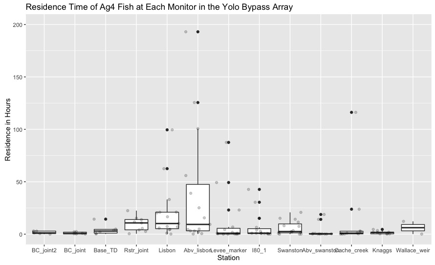
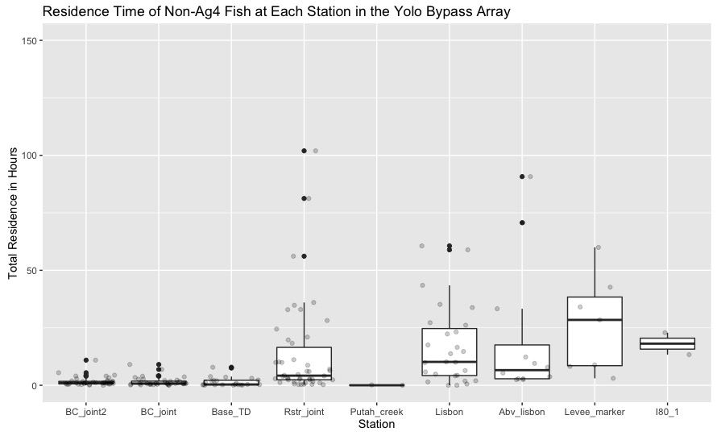
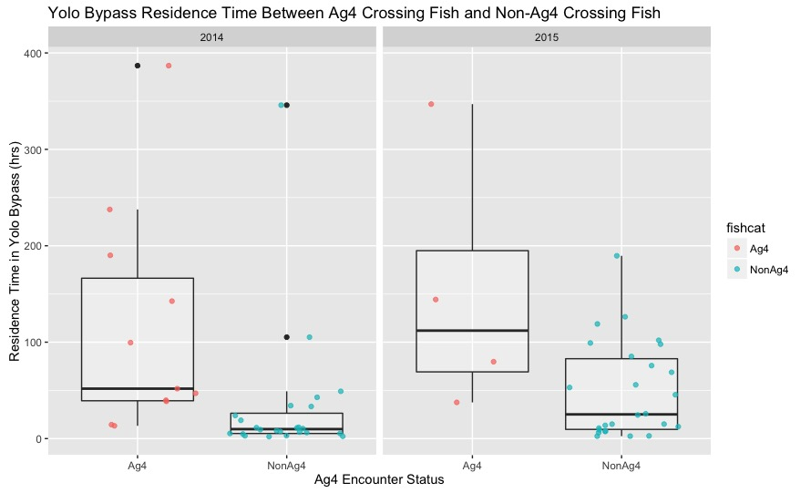
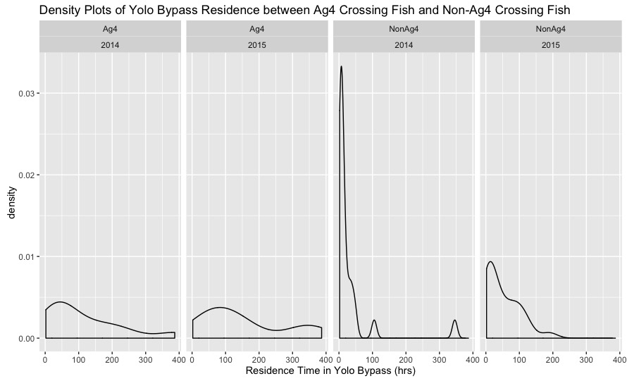

```{r setup, include=FALSE}
knitr::opts_chunk$set(echo = TRUE)
library(ybp)
library(dplyr)
library(ggplot2)
library(stringr)
library(rethinking)
library(knitr)
```

## Overview of Fish Presence in the Yolo Bypass

We have four years (seasons) of data: fall 2012 - fall 2015.  The sample size for 2012 was small (12 fish), so it is generally omitted in the analyses that follow, but below are a couple of plots that are intended to give an overview of fish presence in the Yolo Bypass in space and time:

```{r yolooverview, echo = FALSE, message = FALSE, cache=TRUE}
f <- all69khz

# --- Run this chunk first if you want to group stations for plots --- #
library(stringr)
# Abv_rstr & rstr (121.04 & 121.01) -> rstr_joint (121.0)
# BCE/W <- BC_joint
# BCE/W2 <- BC2_joint
f$Station <- str_replace(f$Station, 'RSTR', 'Rstr_joint')
f$Station <- str_replace(f$Station, 'Abv_rstr', 'Rstr_joint')
f$Station <- str_replace(f$Station, 'BCE' , 'BC_joint')
f$Station <- str_replace(f$Station, 'BCE2', 'BC2_joint') # stringr replaces it with "BC_joint2", but whatevs
f$Station <- str_replace(f$Station, 'BCW' , 'BC_joint')
f$Station <- str_replace(f$Station, 'BCW2', 'BC2_joint') # stringr replaced it with "BC_joint2", but whatevs
f$Rkm[f$Rkm == 121.04] <- 121 # combine rstr and abv_rstr
f$Rkm[f$Rkm == 121.01] <- 121 # combine rstr and abv_rstr
f$year <- lubridate::year(f$DateTagged)
f <- filter(f, Sp == "chn")

d <- f %>% 
  filter(Sp == "chn") %>% 
  group_by(year, Rkm) %>% 
  summarise(nfish = length(unique(TagID)))

# line graph to show us the true distribution of number of fish per riverkm
ggplot(d, aes(Rkm, nfish)) + geom_point() + geom_path() + facet_wrap(~year) + labs(x = "River Kilometer \nBeginning at Confluence, ending at Wallace Weir", y = "Number of Unique Fish Detected", title = "Number of Unique Fish Detected by River Kilometer in the Yolo Bypass \n 2012-2016")

```
<br>
<br>

```{r, echo=FALSE, message=FALSE}
dets <- all69khz
dets$year <- lubridate::year(dets$DateTagged)
dets <- filter(dets, Sp == "chn")

fp <- inner_join(dets, d) # get nfish per riverkm in there
fp$date <- as.Date(fp$DateTimeUTC)
fp <- fp %>% 
  group_by(year, date) %>% 
  filter(!duplicated(date))

fp$jd <- rep("NA", length.out = length(fp$DateTagged))

  for( i in 1:length(fp$jd)) {
  if(fp$year[i] == 2012) {
  fp$jd[i] <- julian(fp$DateTimeUTC[i], origin = as.Date("2012-01-01")) 
} else if(fp$year[i] == 2013) {
 fp$jd[i] <- julian(fp$DateTimeUTC[i], origin = as.Date("2013-01-01")) 
} else if(fp$year[i] == 2014) {
  fp$jd[i] <- julian(fp$DateTimeUTC[i], origin = as.Date("2014-01-01"))
} else { fp$jd[i] <- julian(fp$DateTimeUTC[i], origin = as.Date("2015-01-01"))}
                        }
fp$jd <- as.numeric(fp$jd)

ggplot(fp, aes(x = jd, y = nfish)) + geom_point(aes(color = year), alpha = 0.4, show.legend = FALSE) + facet_wrap(~year) + 
  labs(x = "Julian Day", y = "Number of Unique Fish", title = "Number of Unique Fish Detected by Julian Day in the Yolo Bypass \n 2012-2016") + theme(legend.position = "none")

```

<br>
We generally don't begin tagging before mid-September.  The scales of the Julian Day calendar have been extended so you can better see the carry-over presence of fish tagged in the fall that persist in the Bypass through January.  Note: These data have NOT been filtered for shed tags or mortality yet.


## Analysis of Proportion of Fish that Encounter AgCrossing #4

We had receivers at Ag Crossing #4 (hereafter "Ag4") beginning in 2014.  In 2014, 11 of 35 fish reached the crossing; 9 of those 11 went above it.  In 2015, 4 of 30 fish reached the weir, and all 4 went above it.

```{r echo=FALSE}
ag4plot <- as.data.frame(cbind(year = c(2014, 2015), nfish_encounter = c(11, 4), nfish_continue = c(9, 4),
                               samplesize = c(35, 30)))
ag4plot <- ag4plot %>% 
  mutate(propenc = nfish_encounter/samplesize, propcontinue = nfish_continue/nfish_encounter)
ag4plot

# Plotting proportion of fish encountering Ag4
ggplot(ag4plot, aes(factor(year), propenc, group = 1)) + geom_point(aes(color = factor(year), size= 1), show.legend = FALSE) + geom_path(lty = 2) + scale_y_continuous(limits = c(0, 1)) + labs(x = "Year", y = "Proportion of Tagged Fish", title = "Proportion of tagged fish that encountered Ag Crossing #4 by Year")

# Plotting proportion of fish that continued
ggplot(ag4plot, aes(factor(year), propcontinue, group = 1)) + geom_point(aes(color = factor(year), size= 1), show.legend = FALSE) + geom_path(lty = 2) + scale_y_continuous(limits = c(0, 1)) + labs(x = "Year", y = "Proportion of Fish", title = "Proportion of Fish that Encountered & Passed Above Ag Crossing #4 by Year")

```

## Of the fish that encountered Ag4, how many successfully exited the Bypass?

In 2014, only 1 of the 11 fish that encountered Ag4 was subsequently detected at the Base of the Toe Drain.  None of the fish in 2015 made their way back down.

## What is the migratory delay for Ag4 fish?

It's not clear yet; there does seem to be a significant difference in residence time between Ag4 fish and non-Ag4 fish (bootstrapped confidence interval estimation), but that would make sense since those fish go higher up in the system than the rest.

The plots below have been filtered for suspected shed tags, but no other filters have been applied.  The data are for both 2014 and 2015 combined.  The data are noisy; I'll have to go through it fish-by-fish and year-by-year to see what might be causing the high variance at some stations.



<br>



<br>


<br>
<br>




As for the migratory "delay" caused by Ag4, it seems to be considerable, since only one of the fish that encountered it ever turned around.  It's possible this is a "point of no return", but it's also possible that Lisbon is.  Would have to look deeper into those data.

<br>
<br>

## Environmental data

Coming soon.


